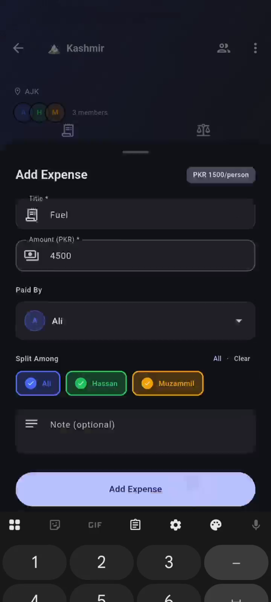
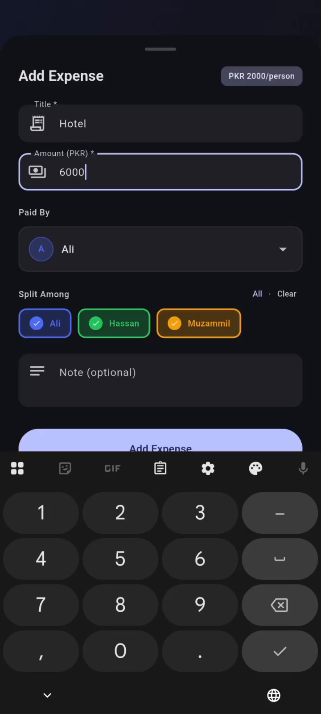
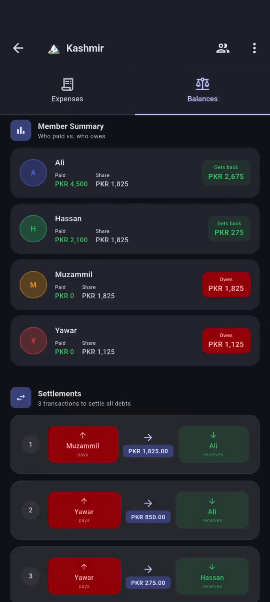

# Hisaab

Hisaab is an offline-first Flutter app for splitting group expenses during trips, treks, road journeys, and shared travel plans. It lets users create trips, add members, record expenses, split costs between selected people, and calculate simple settlement payments without needing a backend or internet connection.

## Features

- Create and edit trips with a name, destination, icon, and members.
- Add, edit, and delete expenses for each trip.
- Select who paid and who should share each expense.
- Manage trip members with add, rename, and remove actions.
- View total trip cost, expense count, member count, and per-person shares.
- See member summaries showing paid amount, owed share, and net balance.
- Generate simplified settlements such as who pays whom and how much.
- Store all trip data locally with Hive for offline use.
- Material 3 interface with light and dark theme support.
- Swipe actions for expense editing and deletion.

## Tech Stack

- Flutter
- Dart
- Provider for state management
- Hive and Hive Flutter for local offline storage
- Hive Generator and Build Runner for model adapters
- UUID for unique trip, member, and expense IDs
- Intl for currency and date formatting
- Flutter Slidable for swipe actions
- Flutter Launcher Icons for app icon generation
- Flutter Lints for static analysis rules

## Project Structure

```text
group_expense_splitter/
  android/                 Android platform project
  assets/                  App icon and static assets
  ios/                     iOS platform project
  lib/
    main.dart              App bootstrap, Hive setup, Provider, and theme
    models/                Trip, member, expense, and settlement models
    providers/             TripProvider state, CRUD, persistence, settlements
    views/
      home/                Trip list, trip cards, and trip creation sheet
      shared/              Reusable dialogs and member avatar widgets
      trip/                Trip dashboard, expenses, balances, members, forms
  linux/                   Linux desktop platform project
  macos/                   macOS desktop platform project
  screenshots/             Real app screenshots used in this README
  test/                    Test folder
  web/                     Flutter web project
  windows/                 Windows desktop platform project
  pubspec.yaml             Flutter dependencies and app metadata
```

## Installation

Install Flutter first, then run the project from PowerShell:

```powershell
Set-Location "C:\FlutterProjects\Hisaab app\group_expense_splitter"
flutter --version
flutter pub get
```

This project requires Dart SDK `>=3.3.0 <4.0.0`. It was checked locally with Flutter `3.41.9` and Dart `3.11.5`.

## Run Commands

Run on a connected Android device or emulator:

```powershell
flutter run
```

Run on Chrome:

```powershell
flutter run -d chrome
```

Run on Windows desktop:

```powershell
flutter run -d windows
```

Build a debug APK:

```powershell
flutter build apk --debug
```

Build a release APK:

```powershell
flutter build apk --release
```

Build for web:

```powershell
flutter build web
```

If you change Hive model fields or annotations, regenerate adapters with:

```powershell
flutter pub run build_runner build --delete-conflicting-outputs
```

## Screenshots

| Empty Trips | Create Trip | Add Expense |
| --- | --- | --- |
|  |  |  |

| Add Hotel Expense | Expense List | Updated Expense List |
| --- | --- | --- |
|  |  |  |

| Balances and Settlements |
| --- |
|  |

## Git and Secret Notes

This app does not currently use a remote backend, `.env` file, API key, Firebase file, Supabase file, or bundled database file. The app data is stored locally on the user's device through Hive.

Do not push generated or local-machine files such as:

- `android/local.properties`
- `ios/Flutter/Generated.xcconfig`
- `ios/Flutter/flutter_export_environment.sh`
- `ios/Flutter/ephemeral/`
- `macos/Flutter/ephemeral/`
- `linux/flutter/ephemeral/`
- `windows/flutter/ephemeral/`
- `.dart_tool/`
- `.gradle/` and `android/.gradle/`
- `build/`
- `*.apk`, `*.aab`, `*.ipa`, `*.exe`, `*.zip`
- `.env`, signing keys, keystores, certificates, and local database files

The `.gitignore` file in this project is set up to exclude those files.

## Author

Muzammil
